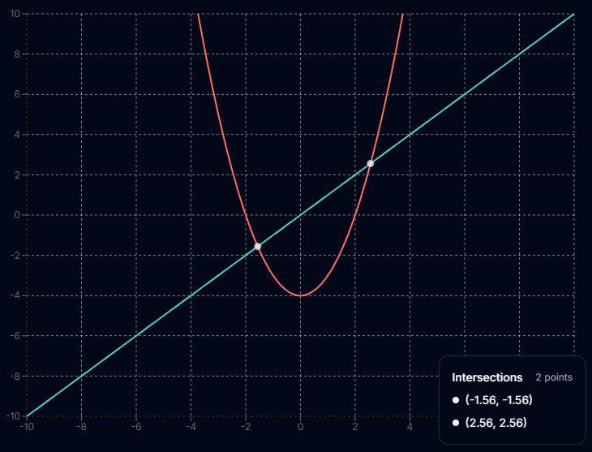

# ⚡ EquationGraffiti - Beautiful Mathematical Visualization 🚀

> **Bringing Equations to Life - Plot, Save, Share & Explore!**  

Yo, EquationGraffiti is an advanced mathematical visualization tool that allows users to **see equations come to life in real-time graphs**. With features like **equation saving, replotting, downloading, and sharing**, this tool is perfect for students, educators, and math enthusiasts!  

---

## 🌟 Features  
✅ **Live Graphing:** Instantly visualize equations on a smooth, interactive graph.  
✅ **Save & Replot:** Store equations and bring them back anytime.  
✅ **Download & Share:** Export graphs as images and share with friends or colleagues.  
✅ **Multiple Equation Support:** Plot up to two equations simultaneously.  
✅ **Beautiful UI:** A sleek, modern, and sci-fi-inspired interface.  

---

## 📸 Screenshots  
### 🔥 Home Page  

### 📈 Graph Plotting  

### 📊 Example Equations  
| Linear | Quadratic | Trigonometric | Lines |
|--------|----------|--------------|-------|
|  |  |  |  |

---

## 🛠️ What Technologies Power This?  

This project is built using modern web technologies to ensure high performance and a seamless user experience:  

- ⚡ **Vite** - Lightning-fast development & build tool.  
- 🦾 **TypeScript** - Type-safe and scalable code.  
- ⚛️ **React** - For dynamic & interactive UI.  
- 🎨 **shadcn-ui** - Beautiful UI components.  
- 🌊 **Tailwind CSS** - For modern and responsive design.  

---

## 🧑‍💻 About the Developer  

Hi, I’m **Sanket Kumar Padhan** 👋, a passionate programmer & tech enthusiast! 🚀  
I love working on modern web projects that merge functionality with aesthetic brilliance. This project is an example of that vision, making math visualization **cool, interactive, and useful** for everyone!  

---

## 🤝 Collaborate With Me!  

Want to contribute, discuss improvements, or work on something awesome together? Let’s connect!  

📩 **Email:** [sanketkumarpadhan95@gmail.com](mailto:sanketkumarpadhan95@gmail.com)  

  
  
  
  
  

---

💙 **Made with passion & code. Keep plotting, keep exploring!** ✨

<!-- 
## What technologies are used for this project?

This project is built with .

- Vite
- TypeScript
- React
- shadcn-ui
- Tailwind CSS -->
